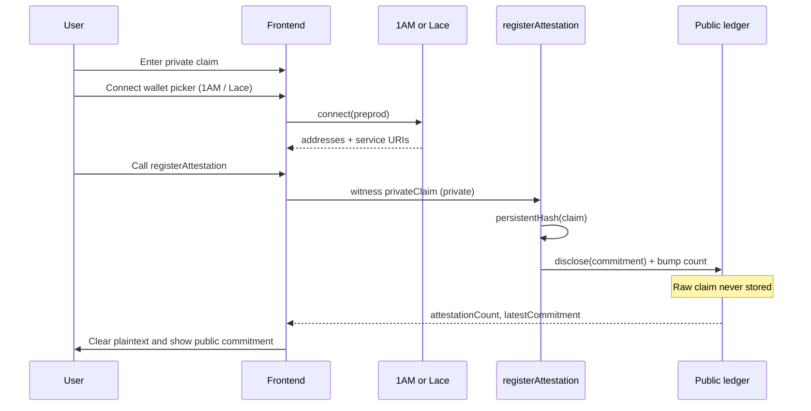
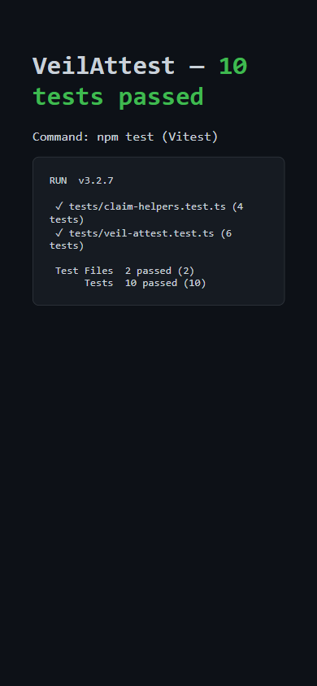

# VeilAttest

[](https://github.com/nishant-uxs/veil-attest/actions/workflows/ci.yml)

Privacy-first attestation registry on **Midnight**. Register a private claim as a witness; only a commitment and a count become public ledger state.

Compact contract, Lace/1AM-connected frontend on **Preprod**, live demo, tests, and CI on every push.

## Product proposal

**Idea-list item:** Confidential Credentials — prove a credential is valid without disclosing it.

**Problem.** Teams need verifiable attestations (KYC, membership, audit findings) but cannot put raw credentials on a public ledger.

**Selective disclosure.** VeilAttest keeps the claim as a Compact **private witness**. The circuit hashes it and uses `disclose()` only for the resulting commitment, then bumps a public count. Downstream apps learn that a valid attestation happened and can read `latestCommitment` / `attestationCount` — not the plaintext credential.

**Live stack.** Preprod contract `00b40b4eb91eb8d6375c1215e1d7746cf066a19a57f795d2894c1cd11cffbf8f`, DApp at https://veil-attest.vercel.app (1AM / Lace), Vitest suite + GitHub Actions CI.

## Midnight.js SDK integration

VeilAttest targets **Midnight.js 4.1.1**. The older checklist package `midnight-js-network-provider` is **not published** on npm for 4.x — network wiring is now `midnight-js-network-id` + wallet connector configuration + indexer/proof providers (same pattern as official Midnight examples).

| Role | Package / module |
| --- | --- |
| DApp connector (Lace / 1AM) | `@midnight-ntwrk/dapp-connector-api` |
| Network ID (Preprod) | `@midnight-ntwrk/midnight-js-network-id` + [`frontend/src/providers/networkProvider.ts`](frontend/src/providers/networkProvider.ts) |
| Public ledger / indexer | `@midnight-ntwrk/midnight-js-indexer-public-data-provider` |
| ZK prove | `@midnight-ntwrk/midnight-js-http-client-proof-provider` |
| ZK assets | `@midnight-ntwrk/midnight-js-fetch-zk-config-provider` |
| Contracts API | `@midnight-ntwrk/midnight-js` (`contracts.deployContract` / `findDeployedContract`) |
| Compact runtime | `@midnight-ntwrk/compact-runtime` |

Wallet connect calls `setNetworkId("preprod")`, then providers merge wallet `getConfiguration()` URIs with Preprod defaults so indexer + proof server always resolve.

## Multi-wallet (Lace + 1AM)

Midnight’s official pattern: wallets inject under `window.midnight`, keyed by UUID or friendly id — **enumerate**, don’t hardcode `window.midnight.mnLace`.

VeilAttest follows the [React wallet connector](https://docs.midnight.network/guides/react-wallet-connect) + [DApp connector API](https://docs.midnight.network/api-reference/dapp-connector) guidance:

1. `listWallets()` scans `Object.keys(window.midnight)`
2. UI picker shows each wallet’s `name` / safe `icon` / `apiVersion`
3. User picks **1AM** or **Lace** → `connect("preprod")`
4. Dedupes duplicate injections (friendly key + UUID)

See `frontend/src/wallet/midnightWallets.ts` + `WalletPicker.tsx`.

## Privacy model

| Layer | What | Visibility |
| --- | --- | --- |
| **Private witness** `privateClaim()` | Raw 32-byte claim from the DApp | Never written to the public ledger in cleartext |
| **Public ledger** `attestationCount` | Number of registrations | On-chain / indexer-visible |
| **Public ledger** `latestCommitment` | `persistentHash(claim)` after `disclose()` | On-chain / indexer-visible |

### What an observer can learn

- That `registerAttestation` succeeded (count increases).
- The latest **commitment** bytes (`persistentHash` of the claim), not the claim itself.
- Wallet-facing public metadata the user chooses to show in the UI (e.g. unshielded address when connected).

### What an observer cannot learn

- The plaintext credential / claim bytes.
- The semantic meaning of the attestation (KYC details, membership id, etc.).
- Any private state left only in the DApp / prover after the form clears.

**Observable privacy behavior in the UI:** after a successful `registerAttestation` call, the form clears the plaintext claim. You can still see `latestCommitment` and `attestationCount` update on Preprod — proof that something was attested without revealing what.

## Architecture




## Live demo

- **Frontend (Vercel):** https://veil-attest.vercel.app
- **Network:** Midnight Preprod
- **Wallets:** multi-wallet picker — **1AM** or **Lace** (enumerates `window.midnight`)
- **Preprod contract address:** `00b40b4eb91eb8d6375c1215e1d7746cf066a19a57f795d2894c1cd11cffbf8f`
- **Demo video:** [veil--attest.mp4 (Google Drive)](https://drive.google.com/file/d/1Gpf3KFH0XVrotMhKWadB_BfPEkMwIgVR/view?usp=sharing)
- **CI:** [GitHub Actions](https://github.com/nishant-uxs/veil-attest/actions/workflows/ci.yml) — managed artifact compile gate + `npm test` + frontend build on every push

## Screenshots

### DApp — desktop


### DApp — mobile (responsive)


### CI/CD — workflow runs


### CI/CD — green run detail


### Tests (≥3 passing)



Also: [`docs/screenshots/tests-passing.html`](docs/screenshots/tests-passing.html) · [`docs/evidence/test-output.txt`](docs/evidence/test-output.txt)

## Requirements

- Node.js **22+**
- Compact CLI — pin **`compact update 0.31.1`** (language 0.23 / runtime 0.16)
- Docker (proof server on `:6300`)
- **1AM** or **Lace** (Midnight) configured for **Preprod**
- Faucet-funded unshielded address + tDUST for fees

## Quick start

```bash
# Inside WSL / Linux, from the repo root
npm install
npm run compile
npm test
docker compose up -d proof-server
npm run deploy -- --network preprod

# Frontend
cd frontend
npm install
cp ../.env.example .env   # set VITE_CONTRACT_ADDRESS
npm run dev
```

Open http://localhost:5173 → **Connect wallet** → join contract → register a private claim.

## Tests & CI

```bash
npm test          # Vitest — contract + managed artifact suite (≥6 tests)
```

CI workflow (`.github/workflows/ci.yml`) on every push/PR to `main`:

1. Assert committed Compact managed artifacts (`compiler` / `contract` / `keys` / `zkir`)
2. `npm test`
3. `frontend` production `npm run build`

Screenshot of passing tests: `docs/screenshots/tests-passing.png` (`npm test` → **10 passed**)

## Project layout

```
contracts/veil-attest.compact
contracts/managed/veil-attest/
frontend/                 # 1AM/Lace wallet + circuit UI
src/deploy.ts
src/witnesses.ts
tests/veil-attest.test.ts
.github/workflows/ci.yml
docs/evidence/
docs/screenshots/
```

## Circuits

| Circuit | Role |
| --- | --- |
| `registerAttestation` | Hash private claim → disclose commitment → bump count |
| `getAttestationCount` | Read public count |
| `getLatestCommitment` | Read public commitment |

## Evidence checklist

### Level 1 — New Moon
- [x] Toolchain + `compact compile` → `managed/` with circuits and keys
- [x] Passing test suite (`npm test`)
- [x] README: setup, public vs private, product idea
- [x] Contract deployed (Preview address recorded)
- [x] Screenshots + meaningful commits

**Preview contract:** `8a9c34f505b2adf457da53a9ab24eee27495d461f2eecd03939c07288952001c`

### Level 2 — Waxing Crescent
- [x] Lace / 1AM connect / disconnect in frontend
- [x] Circuit called from frontend (`registerAttestation`)
- [x] Observable privacy behavior (plaintext cleared; commitment public)
- [x] Contract deployed to **Preprod** — `00b40b4eb91eb8d6375c1215e1d7746cf066a19a57f795d2894c1cd11cffbf8f`
- [x] README privacy claim + mermaid architecture
- [x] Live demo — https://veil-attest.vercel.app
- [x] Demo video — [Drive link](https://drive.google.com/file/d/1Gpf3KFH0XVrotMhKWadB_BfPEkMwIgVR/view?usp=sharing)
- [x] ≥8 meaningful commits

### Level 3 — First Quarter
- [x] Fully functional dApp using Midnight’s privacy model
- [x] Minimum 3 tests passing — **10 passed** · `docs/screenshots/tests-passing.png`
- [x] CI/CD pipeline (workflow + passing runs) — [](https://github.com/nishant-uxs/veil-attest/actions/workflows/ci.yml)
- [x] Approved idea from the list — **Confidential Credentials** · `docs/evidence/IDEA.md`
- [x] Minimum 10 meaningful commits
- [x] Public GitHub with complete README — https://github.com/nishant-uxs/veil-attest
- [x] Live demo link — https://veil-attest.vercel.app
- [x] Demo video (~1 min) — [Drive link](https://drive.google.com/file/d/1Gpf3KFH0XVrotMhKWadB_BfPEkMwIgVR/view?usp=sharing)
- [x] README privacy model: what an observer can / cannot learn
- [x] Product proposal submitted for approval (Identity/credentials)

## License

MIT
