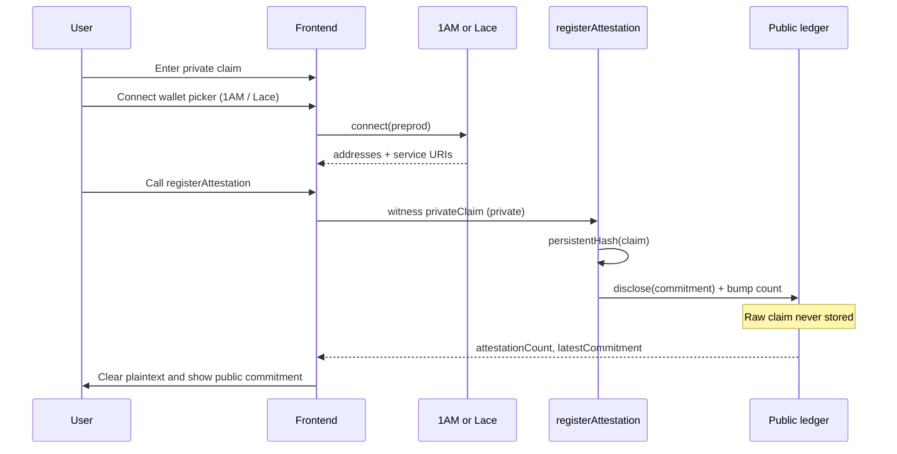
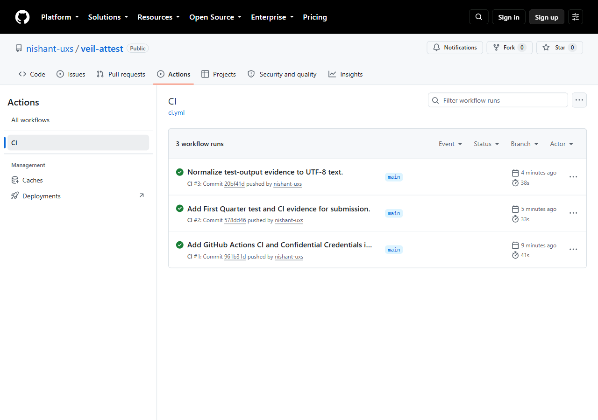
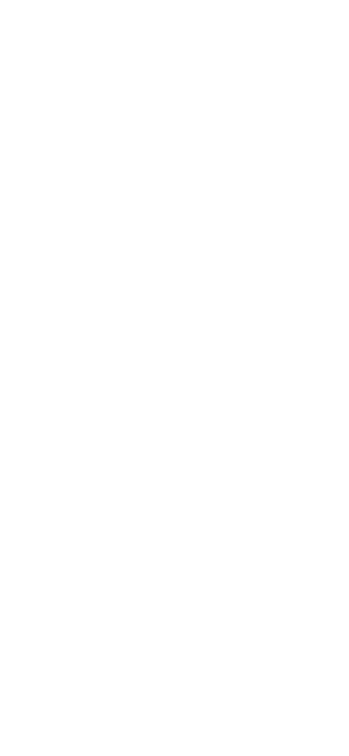
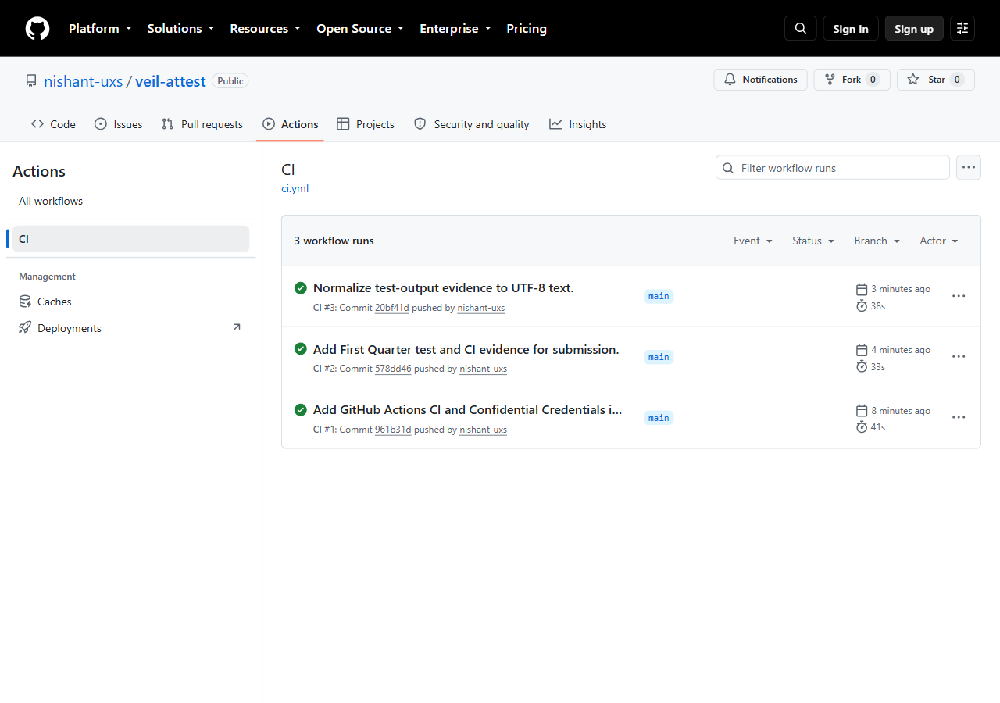
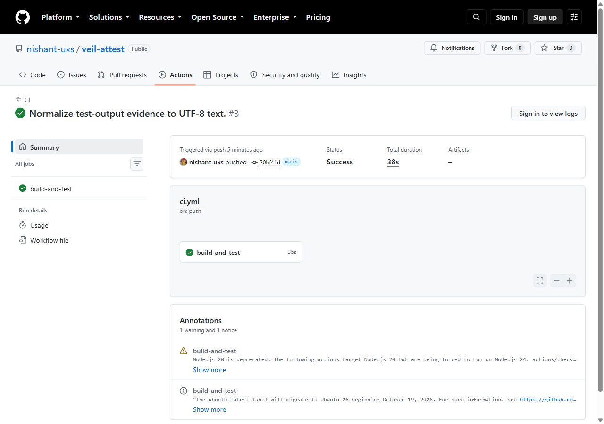

# VeilAttest

[](https://github.com/nishant-uxs/veil-attest/actions/workflows/ci.yml)

Privacy-first attestation registry on **Midnight**. Register a private claim as a witness; only a commitment and a count become public ledger state.

Compact contract, Lace/1AM-connected frontend on **Preprod**, live demo, tests, and CI on every push.

## Product proposal

**Idea-list item:** Confidential Credentials — prove a credential is valid without disclosing it.

**Problem.** Teams need verifiable attestations (KYC, membership, audit findings) but cannot put raw credentials on a public ledger.

**Selective disclosure.** VeilAttest keeps the claim as a Compact **private witness**. The circuit hashes it and uses `disclose()` only for the resulting commitment, then bumps a public count. Downstream apps learn that a valid attestation happened and can read `latestCommitment` / `attestationCount` — not the plaintext credential.

**Live stack.** Preprod contract `00b40b4eb91eb8d6375c1215e1d7746cf066a19a57f795d2894c1cd11cffbf8f`, DApp at https://veil-attest.vercel.app (1AM / Lace), Vitest suite + GitHub Actions CI.

## Privacy model

| Layer | What | Visibility |
| --- | --- | --- |
| **Private witness** `privateClaim()` | Raw 32-byte claim from the DApp | Never written to the public ledger in cleartext |
| **Public ledger** `attestationCount` | Number of registrations | On-chain / indexer-visible |
| **Public ledger** `latestCommitment` | `persistentHash(claim)` after `disclose()` | On-chain / indexer-visible |

### What an observer can learn

- That `registerAttestation` succeeded (count increases).
- The latest **commitment** bytes (`persistentHash` of the claim), not the claim itself.
- Wallet-facing public metadata the user chooses to show in the UI (e.g. unshielded address when connected).

### What an observer cannot learn

- The plaintext credential / claim bytes.
- The semantic meaning of the attestation (KYC details, membership id, etc.).
- Any private state left only in the DApp / prover after the form clears.

**Observable privacy behavior in the UI:** after a successful `registerAttestation` call, the form clears the plaintext claim. You can still see `latestCommitment` and `attestationCount` update on Preprod — proof that something was attested without revealing what.

## Architecture




## Live demo

- **Frontend (Vercel):** https://veil-attest.vercel.app
- **Network:** Midnight Preprod
- **Wallets:** multi-wallet picker — **1AM** or **Lace** (enumerates `window.midnight`)
- **Preprod contract address:** `00b40b4eb91eb8d6375c1215e1d7746cf066a19a57f795d2894c1cd11cffbf8f`
- **Demo video:** [veil--attest.mp4 (Google Drive)](https://drive.google.com/file/d/1Gpf3KFH0XVrotMhKWadB_BfPEkMwIgVR/view?usp=sharing)
- **CI:** [GitHub Actions](https://github.com/nishant-uxs/veil-attest/actions/workflows/ci.yml) — managed artifact compile gate + `npm test` + frontend build on every push

## Screenshots

### DApp — desktop



### DApp — mobile (responsive)



### CI/CD — workflow runs



### CI/CD — green run detail



### Tests (≥3 passing)

See also [`docs/screenshots/tests-passing.html`](docs/screenshots/tests-passing.html) and [`docs/evidence/test-output.txt`](docs/evidence/test-output.txt).

## Requirements

- Node.js **22+**
- Compact CLI — pin **`compact update 0.31.1`** (language 0.23 / runtime 0.16)
- Docker (proof server on `:6300`)
- **1AM** or **Lace** (Midnight) configured for **Preprod**
- Faucet-funded unshielded address + tDUST for fees

## Quick start

```bash
# Inside WSL / Linux, from the repo root
npm install
npm run compile
npm test
docker compose up -d proof-server
npm run deploy -- --network preprod

# Frontend
cd frontend
npm install
cp ../.env.example .env   # set VITE_CONTRACT_ADDRESS
npm run dev
```

Open http://localhost:5173 → **Connect wallet** → join contract → register a private claim.

## Tests & CI

```bash
npm test          # Vitest — contract + managed artifact suite (≥6 tests)
```

CI workflow (`.github/workflows/ci.yml`) on every push/PR to `main`:

1. Assert committed Compact managed artifacts (`compiler` / `contract` / `keys` / `zkir`)
2. `npm test`
3. `frontend` production `npm run build`

Screenshot of passing tests: `docs/screenshots/tests-passing.html`

## Project layout

```
contracts/veil-attest.compact
contracts/managed/veil-attest/
frontend/                 # 1AM/Lace wallet + circuit UI
src/deploy.ts
src/witnesses.ts
tests/veil-attest.test.ts
.github/workflows/ci.yml
docs/evidence/
docs/screenshots/
```

## Circuits

| Circuit | Role |
| --- | --- |
| `registerAttestation` | Hash private claim → disclose commitment → bump count |
| `getAttestationCount` | Read public count |
| `getLatestCommitment` | Read public commitment |

## Evidence checklist

### Contract & toolchain
- [x] Toolchain + `compact compile` → `managed/` with circuits and keys
- [x] Passing test suite (`npm test`, ≥3 tests)
- [x] README: setup, privacy model, product proposal
- [x] Contract deployed on Preview (reference) and Preprod (live demo)
- [x] Screenshots in `docs/screenshots/`

### DApp & Preprod
- [x] Lace / 1AM connect / disconnect in frontend
- [x] Circuit called from frontend (`registerAttestation`)
- [x] Observable privacy behavior (plaintext cleared; commitment public)
- [x] Contract on **Preprod** — `00b40b4eb91eb8d6375c1215e1d7746cf066a19a57f795d2894c1cd11cffbf8f`
- [x] README privacy model + mermaid architecture
- [x] Live demo — https://veil-attest.vercel.app
- [x] Demo video — [Drive link](https://drive.google.com/file/d/1Gpf3KFH0XVrotMhKWadB_BfPEkMwIgVR/view?usp=sharing)

### Production hardening
- [x] CI/CD workflow + badge (compile gate + tests + frontend build)
- [x] Product proposal: Confidential Credentials (Identity/credentials)
- [x] Idea draft: `docs/evidence/IDEA.md`

## License

MIT
