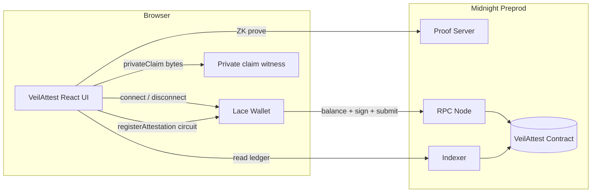

# VeilAttest

Privacy-first attestation registry on **Midnight**. Register a private claim as a witness; only a commitment and a count become public ledger state.

Built for **New Moon → Full**: Level 1 (New Moon) + Level 2 (Waxing Crescent) — Compact contract, Lace-connected frontend on Preprod, live demo.

## Initial product idea

VeilAttest lets teams and individuals attest to business claims (KYC status, inventory counts, audit findings, membership eligibility) without putting the raw claim on-chain. The DApp supplies a 32-byte claim as a **private witness**. The circuit hashes that claim, uses `disclose()` only for the resulting commitment, and increments a public counter. Downstream apps can verify “an attestation happened and this commitment is the latest,” while the plaintext claim never leaves the prover’s private state.

## Privacy claim (Level 2)

| Layer | What | Visibility |
| --- | --- | --- |
| **Private witness** `privateClaim()` | Raw 32-byte claim from the DApp | Never written to the public ledger in cleartext |
| **Public ledger** `attestationCount` | Number of registrations | On-chain / indexer-visible |
| **Public ledger** `latestCommitment` | `persistentHash(claim)` after `disclose()` | On-chain / indexer-visible |

**Observable privacy behavior in the UI:** after a successful `registerAttestation` call, the form clears the plaintext claim. You can still see `latestCommitment` and `attestationCount` update on Preprod — proof that something was attested without revealing what.

## Architecture



```mermaid
sequenceDiagram
  participant User
  participant UI as Frontend
  participant Lace
  participant Circuit as registerAttestation
  participant Ledger as Public ledger
  User->>UI: Enter private claim
  User->>UI: Connect Lace (Preprod)
  UI->>Lace: connect(preprod)
  Lace-->>UI: addresses + service URIs
  User->>UI: Call registerAttestation
  UI->>Circuit: witness privateClaim (private)
  Circuit->>Circuit: persistentHash(claim)
  Circuit->>Ledger: disclose(commitment) + bump count
  Note over Ledger: Raw claim never stored
  Ledger-->>UI: attestationCount, latestCommitment
  UI->>User: Clear plaintext; show public commitment
```

## Live demo

- **Frontend (Vercel):** https://veil-attest.vercel.app
- **Network:** Midnight Preprod
- **Contract address:** see `docs/evidence/DEPLOYMENT.md` (Preprod pending DUST accrual; Preview address available for reference)

## Requirements

- Node.js **22+**
- Compact CLI — pin **`compact update 0.31.1`** (language 0.23 / runtime 0.16)
- Docker (proof server on `:6300`)
- Lace wallet (Midnight) configured for **Preprod**
- Faucet-funded unshielded address + tDUST for fees

## Quick start

```bash
# Inside WSL / Linux, from the repo root
npm install
npm run compile
npm test
docker compose up -d proof-server
npm run deploy -- --network preprod

# Frontend
cd frontend
npm install
cp ../.env.example .env   # set VITE_CONTRACT_ADDRESS
npm run dev
```

Open http://localhost:5173 → **Connect Lace** → join contract → register a private claim.

## Project layout

```
contracts/veil-attest.compact
contracts/managed/veil-attest/
frontend/                 # Lace + circuit UI (Level 2)
src/deploy.ts
src/witnesses.ts
tests/veil-attest.test.ts
docs/evidence/
docs/screenshots/
```

## Circuits

| Circuit | Role |
| --- | --- |
| `registerAttestation` | Hash private claim → disclose commitment → bump count |
| `getAttestationCount` | Read public count |
| `getLatestCommitment` | Read public commitment |

## Evidence checklist

### Level 1 — New Moon
- [x] Toolchain + `compact compile` → `managed/` with circuits and keys
- [x] Passing test suite (`npm test`)
- [x] README: setup, public vs private, product idea
- [x] Contract deployed (Preview address recorded; Preprod for Level 2)
- [x] Screenshots + ≥5 commits

### Level 2 — Waxing Crescent
- [x] Lace connect / disconnect in frontend
- [x] Circuit called from frontend (`registerAttestation`)
- [x] Observable privacy behavior (plaintext cleared; commitment public)
- [ ] Contract deployed to **Preprod** with verifiable address
- [x] README privacy claim + mermaid architecture
- [ ] Live demo link (Vercel)
- [ ] Demo video: wallet connect + successful circuit call
- [x] ≥8 meaningful commits (ongoing)

## License

MIT
